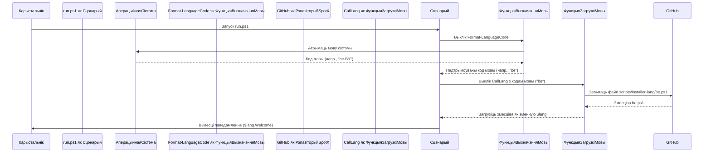

# Chapter 1: Файлы моў


Сардэчна запрашаем у першую главу падручніка па `Патчар SpotX для Spotify`! Тут мы пачнём наша знаёмства з праектам, разглядаючы адзін з самых важных элементаў, які робіць праграму зручнай для карыстальнікаў з усяго свету — **файлы моў**.

## Што такое файлы моў і навошта яны патрэбны?

Уявіце, што вы запускаеце сцэнарый SpotX, каб усталяваць або абнавіць Spotify. Сцэнарый пачынае задаваць вам пытанні: ці хочаце вы схаваць падкасты? Ці заблакаваць абнаўленні? Выводзіць паведамленні пра прагрэс або памылкі. Усю гэту інфармацыю сцэнарый павінен падаць на мове, зразумелай менавіта вам.

Тут на дапамогу прыходзяць **файлы моў**. Думайце пра іх як пра "перакладчыкаў" праекта. Яны змяшчаюць усе тэксты — прывітанні, пытанні, паведамленні — на розных мовах. Калі сцэнарый працуе, ён звяртаецца да гэтых файлаў, каб "размаўляць" з вамі на вашай роднай мове.

**Галоўная задача файлаў моў** — зрабіць узаемадзеянне з сцэнарыем максімальна простым і зразумелым, незалежна ад таго, на якой мове вы размаўляеце.

## Дзе знаходзяцца файлы моў?

Файлы моў SpotX захоўваюцца ў спецыяльнай тэчцы ўнутры праекта. Калі вы глядзіце на структуру файлаў, вы знойдзеце іх у каталогу `scripts/installer-lang`.

Кожны файл у гэтай тэчцы адпавядае пэўнай мове і названы ў адпаведнасці з двухлітарным кодам гэтай мовы (напрыклад, `be.ps1` для беларускай, `en.ps1` для англійскай, `ru.ps1` для рускай).

Вось як выглядае частка змесціва беларускага файла `be.ps1`:

```powershell
[PSCustomObject]@{
    Welcome         = "
╔════════════════════════════════════════╗
║ Сардэчна запрашаем у SpotX для Windows ║
╚════════════════════════════════════════╝"
    Incorrect       = "Вой, няправільнае значэнне,"
    Incorrect2      = "увядзіце зноў праз "
    # ... іншыя радкі мовы
}
```

Гэты код паказвае, што файл мовы — гэта спіс фраз. Кожная фраза мае імя (напрыклад, `Welcome`, `Incorrect`) і значэнне — сам тэкст на беларускай мове.

## Як сцэнарый выбірае патрэбны файл мовы?

Сцэнарый `run.ps1` (галоўны сцэнарый устаноўкі) аўтаматычна вызначае мову вашай аперацыйнай сістэмы, калі вы яго запускаеце. Затым ён спрабуе знайсці і загрузіць файл мовы, які адпавядае вызначанай мове. Калі файл для вашай мовы не знойдзены або не падтрымліваецца, сцэнарый, як правіла, вяртаецца да англійскай мовы (файл `en.ps1`), каб гарантаваць, што паведамленні будуць хоць неяк зразумелыя.

Вы таксама можаце ўказаць патрэбную мову ўручную пры запуску сцэнарыя, выкарыстоўваючы параметр `-language` або `-l`. Гэта зручна, калі мова сістэмы адрозніваецца ад той, на якой вы хочаце бачыць паведамленні сцэнарыя.

Напрыклад, каб прымусова запусціць сцэнарый на беларускай мове, вы выкарыстаеце:

```powershell
.\run.ps1 -language be
# ці
.\run.ps1 -l be
```

## Як сцэнарый выкарыстоўвае загружаную мову?

Пасля таго, як сцэнарый вызначыў і загрузіў файл мовы, ён захоўвае ўсе фразы ў спецыяльнай зменнай, якую мы можам назваць `$lang`. Кожны раз, калі сцэнарыю трэба нешта сказаць карыстальніку (вывесці прывітанне, задаць пытанне, паказаць памылку), ён звяртаецца да гэтай зменнай па імені патрэбнай фразы.

Напрыклад, каб вывесці прывітанне ў пачатку працы, сцэнарый выкарыстоўвае:

```powershell
# Выводзім прывітальны тэкст, які быў загружаны са файла мовы
Write-Host ($lang).Welcome
```

Калі вы запусцілі сцэнарый на беларускай мове, `$lang.Welcome` будзе ўтрымліваць тэкст на беларускай. Калі на англійскай — на англійскай, і гэтак далей.

Гэта робіць сцэнарый гнуткім і зручным для перакладу на новыя мовы, паколькі ўсе тэксты сабраны ў асобных файлах, а не раскіданы па асноўным кодзе.

## Як гэта працуе ўнутры (спрошчана)?

Вось як адбываецца працэс вызначэння і загрузкі мовы:



На самым пачатку сцэнарыя `run.ps1` ёсць радкі, якія адказваюць за гэты працэс:

```powershell
# Усталёўваем код мовы для сцэнарыя.
$langCode = Format-LanguageCode -LanguageCode $Language # $Language - гэта параметр -language, калі ўказаны

# Загружаем моўныя радкі ў зменную $lang
$lang = CallLang -clg $langCode

# Выводзім прывітальны тэкст
Write-Host ($lang).Welcome
Write-Host
```

Тут `Format-LanguageCode` вызначае патрэбны двухлітарны код мовы, а `CallLang` загружае адпаведны файл мовы з інтэрнэту і робіць яго змесціва даступным праз зменную `$lang`.

## Высновы

Файлы моў — гэта першы крок да разумення таго, як працуе `Патчар SpotX для Spotify`. Яны адказваюць за тое, каб сцэнарый быў зручным і зразумелым для карыстальнікаў па ўсім свеце, дазваляючы яму "размаўляць" на мове сістэмы або мове, абранай карыстальнікам.

У наступнай главе мы паглыбімся ў [Галоўны сцэнарый устаноўкі](02_галоўны_сцэнарый_устаноўкі_.md) (`run.ps1`) і разгледзім, як ён кіруе ўсім працэсам патчавання Spotify.

[Глава 2: Галоўны сцэнарый устаноўкі](02_галоўны_сцэнарый_устаноўкі_.md)

---

Generated by [AI Codebase Knowledge Builder](https://github.com/The-Pocket/Tutorial-Codebase-Knowledge)