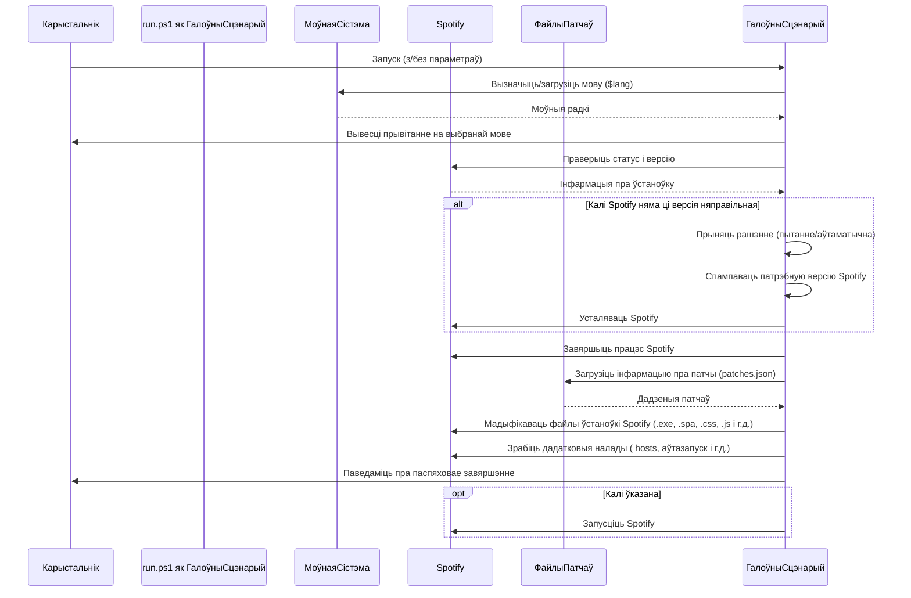

# Chapter 2: Галоўны сцэнарый устаноўкі


Сардэчна запрашаем назад! У [першым раздзеле](01_файлы_моў_.md) мы даведаліся пра важнасць файлаў моў, якія дапамагаюць `Патчар SpotX для Spotify` размаўляць з вамі на вашай мове. Але хто кіруе ўсёй гэтай "размовай" і выконвае галоўную працу па патчаванні Spotify? Менавіта пра гэта мы пагаворым у гэтай главе.

## Што такое Галоўны сцэнарый устаноўкі?

Уявіце `Патчар SpotX для Spotify` як вялікі аркестр. Кожны інструмент (ці функцыя ў кодзе) мае сваю ролю. Але хто кіруе аркестрам, кажучы, калі якому інструменту іграць? Гэта дырыжор!

У нашым праекце гэтым "дырыжорам" з'яўляецца **Галоўны сцэнарый устаноўкі**. Яго файл называецца `run.ps1`. Гэта сэрца і мозг усяго праекта. Калі вы запускаеце SpotX, вы на самой справе запускаеце менавіта гэты сцэнарый.

Яго асноўная задача - гэта **каардынацыя** ўсіх дзеянняў:

*   Ён прымае вашыя інструкцыі (праз так званыя "параметры").
*   Ён правярае, ці ўсё гатова для працы (напрыклад, ці ўсталяваны Spotify і ці падтрымліваецца яго версія).
*   Ён вырашае, якія крокі трэба зрабіць далей: спампаваць Spotify, выдаліць старую версію, ужыць патчы да файлаў, наладзіць розныя функцыі і г.д.
*   Ён выклікае іншыя, меншыя часткі кода (функцыі ці дапаможныя сцэнарыі) для выканання пэўных задач.
*   Ён паведамляе вам пра ход выканання і пра любыя праблемы, якія могуць узнікнуць, выкарыстоўваючы моўныя файлы, пра якія мы гаварылі раней.

Думайце пра `run.ps1` як пра менеджара праекта "Патчаванне Spotify". Ён не выконвае ўсю працу сам, але ён ведае, хто што павінен зрабіць і ў якой паслядоўнасці.

## Як выкарыстоўваць Галоўны сцэнарый?

Выкарыстанне галоўнага сцэнарыя вельмі простае: вы проста запускаеце яго! Звычайна вы робіце гэта праз камандны радок (Windows PowerShell або Камандны радок), перайшоўшы ў тэчку, дзе знаходзіцца файл `run.ps1`, і ўвёўшы каманду.

Самы просты спосаб запуску (пры ўмове, што вы ўжо спампавалі файлы праекта):

```powershell
.\run.ps1
```

Калі вы запускаеце яго такім чынам, сцэнарый будзе выкарыстоўваць налады па змаўчанні і, магчыма, задасць вам некалькі пытанняў.

Але галоўны сцэнарый становіцца нашмат больш магутным, калі вы даяце яму канкрэтныя інструкцыі праз **параметры**. Параметры - гэта спецыяльныя словы, якія вы дадаеце пасля імя сцэнарыя пры запуску, каб сказаць яму, што вы хочаце зрабіць.

Напрыклад, калі вы хочаце ўсталяваць Spotify з новай тэмай і заблакаваць абнаўленні, вы можаце выкарыстаць параметры:

```powershell
.\run.ps1 -new_theme -block_update_on
```

*   `.\run.ps1`: Запуск галоўнага сцэнарыя.
*   `-new_theme`: Параметр, які ўключае ўстаноўку новай тэмы.
*   `-block_update_on`: Параметр, які загадвае сцэнарыю заблакаваць аўтаматычныя абнаўленні Spotify.

Гэтыя параметры даюць сцэнарыю канкрэтныя ўказанні, і ён будзе старацца выканаць патчаванне ў адпаведнасці з імі, не задаючы вам дадатковых пытанняў (пры пэўных параметрах). Мы падрабязней разгледзім параметры ў наступнай главе.

Вы таксама можаце запусціць сцэнарый праз простыя пакетныя файлы (.bat), якія проста выклікаюць `run.ps1` з пэўнымі параметрамі. Напрыклад, файл `scripts/Install_Auto.bat` у праекце робіць менавіта гэта:

```bat
@echo off
:: Line for changing spotx parameters, each parameter should be separated by a space
set param=-confirm_uninstall_ms_spoti -confirm_spoti_recomended_over -podcasts_off -block_update_on -start_spoti -new_theme -adsections_off -lyrics_stat spotify

:: ... код для спампоўвання і запуску Powershell ...

%SYSTEMROOT%\System32\WindowsPowerShell\v1.0\powershell.exe ^
-Command %tls% $p='%param%'; """ & { $(try { iwr -useb %url% } catch { $p+= ' -m'; iwr -useb %url2% })} $p """" | iex

pause
exit /b
```

Тут радок `set param=...` вызначае параметры, якія будуць перададзены сцэнарыю `run.ps1` пры яго запуску з інтэрнэту.

## Што адбываецца ўнутры (спрошчана)?

Калі вы запускаеце `run.ps1`, ён праходзіць праз шэраг крокаў. Вось вельмі спрошчаная схема таго, як ён кіруе працэсам:



Як бачыце, галоўны сцэнарый дзейнічае як цэнтральны камандны пункт, які паслядоўна выконвае ўсе неабходныя аперацыі.

## Зазірнем у код run.ps1

Файл `run.ps1` змяшчае шмат кода, але мы паглядзім на некалькі ключавых частак, якія паказваюць, як ён кіруе працэсам.

**1. Вызначэнне параметраў:**
У самым пачатку файла `run.ps1` ёсць блок `param()`. Тут галоўны сцэнарый вызначае, якія інструкцыі (параметры) ён можа прымаць ад карыстальніка.

```powershell
param
(
    [Parameter(HelpMessage = "Change recommended version of Spotify.")]
    [Alias("v")]
    [string]$version,

    [Parameter(HelpMessage = "Use github.io mirror instead of raw.githubusercontent.")]
    [Alias("m")]
    [switch]$mirror,

    # ... шмат іншых параметраў ...

    [Parameter(HelpMessage = 'Select the desired language to use for installation. Default is the detected system language.')]
    [Alias('l')]
    [string]$language
)
```

Кожны радок у гэтым блоку (`[string]$version`, `[switch]$mirror` і г.д.) апісвае адзін з параметраў, які сцэнарый можа зразумець. Калі вы запускаеце `.\run.ps1 -mirror`, сцэнарый бачыць параметр `-mirror` і ўсталёўвае адпаведную зменную `$mirror` у значэнне `True`. Гэта дазваляе вам наладжваць паводзіны сцэнарыя.

**2. Загрузка мовы:**
Адразу пасля вызначэння параметраў сцэнарый загружае моўныя радкі, як мы бачылі ў папярэдняй главе:

```powershell
# Усталёўваем код мовы для сцэнарыя.
$langCode = Format-LanguageCode -LanguageCode $Language # Выкарыстоўваем параметр -language, калі ён быў указаны

# Загружаем моўныя радкі ў зменную $lang
$lang = CallLang -clg $langCode

# Выводзім прывітальны тэкст
Write-Host ($lang).Welcome
Write-Host
```

Гэтыя радкі гарантуюць, што ўсе далейшыя паведамленні будуць на патрэбнай вам мове. Функцыі `Format-LanguageCode` і `CallLang` выконваюць усю складаную працу тут.

**3. Праверкі і рашэнні:**
Далей ідзе шмат кода, які правярае асяроддзе: версію Windows, ці ўсталяваны Spotify, яго версію і г.д. На аснове гэтых праверак і перададзеных параметраў сцэнарый прымае рашэнні. Напрыклад, частка кода, якая правярае версію Spotify і вырашае, ці трэба яго абнавіць/пераўсталяваць:

```powershell
# Калі Spotify усталяваны
if ($spotifyInstalled) {

    # ... праверка версіі ўсталяванага Spotify ...

    # Калі ўсталяваная версія старэйшая за рэкамендаваную
    if ($oldversion) {
        # ... код для прапановы абнавіць або выдаліць старую версію ...
        if ($ch -eq 'y') {
            $upgrade_client = $true
            # ... код для выдалення старой версіі, калі выбрана ...
        }
        # ... і г.д. ...
    }
    # Калі ўсталяваная версія непадтрымоўваная (занадта новая)
    if ($testversion) {
        # ... код для прапановы перайсці на рэкамендаваную версію ...
        if ($ch -eq 'y') { $upgrade_client = $false } # Працягваем з бягучай версіяй
        if ($ch -eq 'n') {
            # ... код для прапановы ўсталяваць рэкамендаваную версію ...
            if ($ch -eq 'y') {
                 $upgrade_client = $true # Усталёўваем рэкамендаваную
                 $downgrading = $true
                 # ... код для выдалення непадтрымоўванай версіі ...
            }
            # ... і г.д. ...
        }
    }
}

# Калі Spotify не ўсталяваны або трэба абнавіць/пераўсталяваць
if (-not $spotifyInstalled -or $upgrade_client) {
    Write-Host ($lang).DownSpoti"" -NoNewline # Паведамляем пра спампоўку
    Write-Host  $online -ForegroundColor Green
    # ... код для выдалення існуючых файлаў ...
    downloadSp # Выклікаем функцыю для спампоўвання Spotify
    # ... код для запуску ўстаноўкі Spotify ...
    wait-process -name SpotifySetup # Чакаем завяршэння ўстаноўкі
    Kill-Spotify # Забіваем працэсы Spotify пасля ўстаноўкі
}
```

Гэты фрагмент паказвае, як сцэнарый правярае стан Spotify і на аснове гэтага (і адказаў карыстальніка або параметраў) вырашае, ці трэба спампоўваць і ўсталёўваць новую версію. Функцыя `downloadSp` (код якой мы не паказваем тут цалкам) адказвае непасрэдна за працэс спампоўвання.

**4. Выклік функцый патчавання:**
Пасля ўсіх праверак і пры неабходнасці ўстаноўкі Spotify, галоўны сцэнарый пераходзіць да самай галоўнай часткі - патчавання файлаў. Ён загружае інфармацыю пра патчы з файла `patches.json` (які мы разгледзім у [чацвёртай главе](04_логіка_патчавання_файлаў_spotify_.md)) і выклікае функцыі, якія непасрэдна змяняюць файлы Spotify.

```powershell
# ... код загрузкі patches.json ...

# Мадыфікацыя файлаў у архіве xpui.spa
if ($test_spa) {

    # ... код для падрыхтоўкі файлаў у архіве ...

    # Напрыклад, патч для выдалення рэкламы (толькі калі не прэміум)
    if (!($premium)) {
        extract -counts 'one' -method 'zip' -name 'xpui.js' -helper 'OffadsonFullscreen'
    }

    # Патч для прымусовага ўключэння/выключэння эксперыментальных функцый
    extract -counts 'one' -method 'zip' -name 'xpui.js' -helper 'ForcedExp' -add $webjson.others.byspotx.add

    # ... выклікі іншых функцый extract/injection для розных патчаў ...
}

# Патчаванне асноўнага выканальнага файла Spotify.exe
extract -counts 'exe' -helper 'Binary'

# ... код для іншых налад (hosts, ярлыкі і г.д.) ...
```

Тут мы бачым, як галоўны сцэнарый выклікае функцыі накшталт `extract` і `injection` (якія апісаны ніжэй у файле `run.ps1`, але іх дэталі мы апусцім тут для прастаты), перадаючы ім інструкцыі аб тым, які файл патчыць (`-name`), як яго патчыць (`-helper` з указаннем патча з `patches.json`) і дзе ён знаходзіцца (напрыклад, унутры `xpui.spa` з метадам `zip`).

Гэтыя прыклады паказваюць, што `run.ps1` не ўтрымлівае ў сабе ўсю логіку змены файлаў (гэтым займаюцца функцыі, якія ён выклікае), але ён вызначае, калі і якія функцыі выклікаць, у залежнасці ад пачатковых праверак, параметраў і змесціва `patches.json`.

## Высновы

Галоўны сцэнарый устаноўкі (`run.ps1`) - гэта камандны цэнтр `Патчар SpotX для Spotify`. Ён прымае вашыя інструкцыі праз параметры, вызначае бягучы стан вашай устаноўкі Spotify і кіруе ўсім працэсам: ад спампоўвання патрэбнай версіі да ўжывання ўсіх неабходных патчаў і налад. Разуменне яго ролі дапамагае зразумець, як увесь праект працуе разам.

У наступнай главе мы падрабязней разгледзім, як менавіта працуе **Апрацоўка параметраў** і як вы можаце выкарыстоўваць іх, каб цалкам наладзіць працэс патчавання пад свае патрэбы.

[Раздзел 3: Апрацоўка параметраў](03_апрацоўка_параметраў_.md)

---

Generated by [AI Codebase Knowledge Builder](https://github.com/The-Pocket/Tutorial-Codebase-Knowledge)