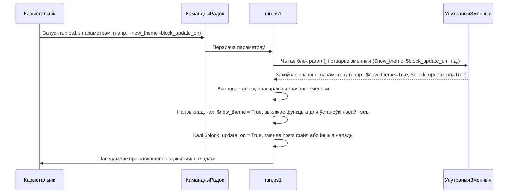

# Chapter 3: Апрацоўка параметраў


Сардэчна запрашаем у трэцюю главу нашага падручніка па `Патчар SpotX для Spotify`! У [першым раздзеле](01_файлы_моў_.md) мы даведаліся, як SpotX "размаўляе" з намі на роднай мове, а ў [другім раздзеле](02_галоўны_сцэнарый_устаноўкі_.md) мы разгледзелі Галоўны сцэнарый (`run.ps1`), які кіруе ўсім працэсам. Цяпер мы паглыбімся ў тое, як менавіта вы даяце Галоўнаму сцэнарыю інструкцыі — праз **апрацоўку параметраў**.

## Што такое параметры і навошта яны патрэбны?

Уявіце, што Галоўны сцэнарый — гэта шэф-повар, які рыхтуе страву (патчуе Spotify). Каб прыгатаваць *вашу* страву менавіта так, як вы хочаце (напрыклад, без падкастаў, з пэўнай тэмай, з заблакаванымі абнаўленнямі), шэф-повару патрэбны рэцэпт і інструкцыі.

**Параметры** — гэта і ёсць тыя інструкцыі. Яны дзейнічаюць як "меню опцый", якое вы перадаеце Галоўнаму сцэнарыю пры яго запуску. Замест таго, каб сцэнарый кожны раз задаваў вам пытанні ("Ці адключыць падкасты? [Y/N]"), вы можаце загадзя ўказаць усе свае пажаданні з дапамогай параметраў.

**Галоўная задача апрацоўкі параметраў** — дазволіць вам цалкам наладзіць працэс патчавання і функцыянальнасць Spotify, якую вы хочаце атрымаць, не змяняючы сам код сцэнарыя і не ўводзячы адказы ўручную.

## Як выглядаюць параметры?

Параметры ў SpotX (які напісаны на PowerShell) пачынаюцца са знака мінуса (`-`) і ідуць адразу пасля назвы сцэнарыя пры запуску.

Напрыклад:

*   `-podcasts_off`: Гэты параметр загадвае сцэнарыю адключыць падкасты.
*   `-block_update_on`: Гэты параметр загадвае заблакаваць аўтаматычныя абнаўленні Spotify.
*   `-new_theme`: Гэты параметр уключае новую тэму і звязаныя з ёй візуальныя змены.

Некаторыя параметры, як паказаныя вышэй, з'яўляюцца так званымі **перамыкачамі (switches)**. Яны проста ўключаюць або выключаюць пэўную функцыю. Вы іх проста ўказваеце або не ўказваеце.

Іншыя параметры патрабуюць **значэння**. Напрыклад, параметр `-language` патрабуе ўказаць код мовы:

*   `-language be`: Усталёўвае беларускую мову інтэрфейсу сцэнарыя.
*   `-language en`: Усталёўвае англійскую мову.

Вы можаце выкарыстоўваць некалькі параметраў адначасова, проста пералічваючы іх праз прабел:

```powershell
.\run.ps1 -podcasts_off -block_update_on -new_theme -language be
```

Гэтая каманда запускае сцэнарый на беларускай мове і загадвае яму адключыць падкасты, заблакаваць абнаўленні і ўключыць новую тэму.

## Наш прыклад: Устаноўка з новай тэмай і заблакаванымі абнаўленнямі

Давайце спынімся на простым прыкладзе: вы хочаце ўсталяваць або абнавіць Spotify з дапамогай SpotX, пры гэтым уключыць **новую тэму** і **заблакаваць аўтаматычныя абнаўленні**.

Як гэта зрабіць, выкарыстоўваючы параметры?

1.  Вызначыце, якія параметры вам патрэбны для гэтых дзеянняў. Згодна з дакументацыяй SpotX (або паглядзеўшы ў код сцэнарыя), гэта `-new_theme` і `-block_update_on`.
2.  Адкрыйце Windows PowerShell або Камандны радок.
3.  Перайдзіце ў тэчку, дзе знаходзіцца `run.ps1`.
4.  Запусціце сцэнарый, дадаўшы патрэбныя параметры:

    ```powershell
    .\run.ps1 -new_theme -block_update_on
    ```

Калі вы запусціце сцэнарый з гэтымі параметрамі, ён прапусціць пытанні пра тэму і абнаўленні (пры ўмове, што няма іншых канфліктаў або неабходных дзеянняў, як, напрыклад, пераўстаноўка Spotify) і выканае патчаванне ў адпаведнасці з указаннямі.

## Выкарыстанне параметраў праз .bat файлы

Большасць карыстальнікаў запускаюць SpotX непасрэдна з `.bat` файлаў (як `Install.bat`, `Install_Auto.bat` або `Install_New_theme.bat`), якія спампоўваюць і запускаюць сцэнарый `run.ps1` з інтэрнэту. Гэтыя `.bat` файлы таксама выкарыстоўваюць параметры.

Паглядзім на фрагмент файла `Install_New_theme.bat`, які быў прыведзены ў папярэдняй главе:

```bat
@echo off

:: Line for changing spotx parameters, each parameter should be separated by a space
set param=-new_theme

:: ... код для спампоўвання і запуску Powershell ...

%SYSTEMROOT%\System32\WindowsPowerShell\v1.0\powershell.exe ^
-Command %tls% $p='%param%'; """ & { $(try { iwr -useb %url% } catch { $p+= ' -m'; iwr -useb %url2% })} $p """" | iex

pause
exit /b
```

Тут ключавы радок:
```bat
set param=-new_theme
```
Гэты радок стварае зменную `param` і прысвойвае ёй значэнне `-new_theme`. Далей у сцэнарыі PowerShell (складаная каманда пасля `powershell.exe`) гэта значэнне (`%param%`) перадаецца як параметры для запуску `run.ps1`. Гэта дазваляе проста адрэдагаваць гэты адзін радок у файле `.bat`, каб змяніць параметры запуску SpotX.

Каб рэалізаваць наш прыклад (`-new_theme` і `-block_update_on`) праз `.bat` файл, мы проста адрэдагуем гэты радок:

```bat
set param=-new_theme -block_update_on
```

Захаваўшы файл `.bat` са змененай камандай `set param`, пры наступным запуску гэтага файла SpotX аўтаматычна ўстановіцца з новай тэмай і заблакаванымі абнаўленнямі.

## Як SpotX апрацоўвае параметры ўнутры? (Спрошчана)

Як Галоўны сцэнарый разумее, якія параметры вы яму перадалі?

1.  **Вызначэнне Параметраў (`param()` блок):** У самым пачатку файла `run.ps1` ёсць спецыяльны блок `param()`. Гэта як "меню" або "спіс інгрэдыентаў", які Галоўны сцэнарый паказвае аперацыйнай сістэме, кажучы: "Я разумею вось гэтыя інструкцыі". Кожны параметр, які сцэнарый можа прыняць, аб'яўляецца тут. PowerShell аўтаматычна чытае каманду запуску і, калі бачыць адпаведны параметр (напрыклад, `-new_theme`), ён усталёўвае ўнутраную зменную з такім жа або падобным імем (у нашым выпадку `$new_theme`) у значэнне `True` (для перамыкачоў) або ўказанае вамі значэнне (для параметраў са значэннем).

    Вось як выглядае фрагмент гэтага блока ў `run.ps1`:

    ```powershell
    param
    (
        # ... іншыя параметры ...

        [Parameter(HelpMessage = 'Block Spotify automatic updates.')]
        [switch]$block_update_on, # Гэты параметр будзе даступны як зменная $block_update_on

        # ... іншыя параметры ...

        [Parameter(HelpMessage = 'New theme activated (new right and left sidebar, some cover change)')]
        [switch]$new_theme, # Гэты параметр будзе даступны як зменная $new_theme

        # ... іншыя параметры ...
    )
    ```

    Тут `[switch]` паказвае, што гэта параметр-перамыкач (проста ўключаецца/выключаецца), а `$block_update_on` і `$new_theme` - гэта імёны ўнутраных зменных, якія будуць мець значэнне `True`, калі вы ўказалі адпаведны параметр пры запуску.

2.  **Чытанне Значэнняў Параметраў і Прыняцце Рашэнняў:** Пасля таго, як параметры апрацаваны PowerShell і іх значэнні захаваны ва ўнутраных зменных, Галоўны сцэнарый пачынае сваю працу. Па меры выканання ён правярае значэнні гэтых зменных (`$block_update_on`, `$new_theme`, `$podcasts_off` і г.д.) і на аснове іх прымае рашэнні аб тым, што рабіць далей.

Вось спрошчаная схема гэтага працэсу:



3.  **Уплыў на Патчаванне:** Як параметры ўплываюць на саму логіку патчавання файлаў Spotify (пра якую мы пагаворым падрабязней у наступнай главе)? Галоўны сцэнарый часта выкарыстоўвае значэнні параметраў, каб вырашыць, якія "дапаможнікі" (функцыі, якія выконваюць канкрэтныя змены ў файлах) выклікаць, або якія часткі патчаў ужываць.

    Напрыклад, ёсць функцыя `Helper` у `run.ps1`, якая адказвае за прымяненне розных дробных патчаў. Частка гэтай функцыі (спрошчана) можа выглядаць так:

    ```powershell
    function Helper($paramname) {
        # ... іншы код функцыі Helper ...

        switch ( $paramname ) {
            # ... іншыя варыянты switch ...
            "ForcedExp" {
                # Патч для прымусовага ўключэння/выключэння эксперыментальных функцый

                # ... шмат кода для апрацоўкі эксперыментальных функцый ...

                # Калі параметр $podcast_off быў перададзены пры запуску
                if ($podcast_off) {
                    Move-Json -n 'HomePin' -t $Enable -f $Disable # Ужываем частку патча, якая адключае HomePin (звязана з падкастамі)
                }

                # Старая тэма (калі параметр $new_theme НЕ быў перададзены)
                if (!($new_theme) -and [version]$offline -le [version]"1.2.13.661") {
                    Move-Json -n 'RightSidebar', 'LeftSidebar' -t $Enable -f $Disable # Адключаем новыя бакавыя панэлі
                    # ... іншыя змены, звязаныя са старой тэмай ...
                }
                # Новая тэма (калі параметр $new_theme БЫЎ перададзены)
                else {
                    if ($rightsidebar_off -and [version]$offline -lt [version]"1.2.24.756") {
                         Move-Json -n 'RightSidebar' -t $Enable -from $Disable
                    }
                    else {
                        # Калі параметр $rightsidebarcolor НЕ быў перададзены
                        if (!($rightsidebarcolor)) { Remove-Json -j $Enable -p 'RightSidebarColors' }
                        if ($old_lyrics) { Remove-Json -j $Enable -p 'RightSidebarLyrics' }
                    }
                }

                # ... іншы код функцыі Helper ...

                $name = "patches.json.others."
                $n = "xpui.js"
                $contents = "ForcedExp" # Указваем, які патч з patches.json выкарыстоўваем
                $json = $webjson.others
            }
            # ... іншыя варыянты switch ...
            "Binary" {
                # Патчаванне асноўнага выканальнага файла Spotify.exe

                $binary = $webjson.others.binary

                # Калі параметр $not_block_update (вынік параметра $block_update_on) роўны True
                if ($not_block_update) { Remove-Json -j $binary -p 'block_update' } # Выдаляем частку патча, якая блакуе абнаўленні

                # Калі параметр $premium быў перададзены
                if ($premium) { Remove-Json -j $binary -p 'block_slots_2', 'block_slots_3' } # Выдаляем патчы для блакіроўкі слотаў рэкламы

                # ... іншыя бінарныя патчы ...

                $name = "patches.json.others.binary."
                $n = "Spotify.exe"
                $contents = $webjson.others.binary.psobject.properties.name
                $json = $webjson.others.binary
            }
        }
        # ... астатні код функцыі Helper, які прымяняе патчы на аснове $json.$PSItem ...
    }
    ```

    Гэтыя фрагменты кода паказваюць, як функцыя `Helper` (якую выклікае Галоўны сцэнарый) правярае значэнні ўнутраных зменных (`$podcast_off`, `$new_theme`, `$premium`, `$not_block_update`), якія былі зададзены параметрамі пры запуску, і на аснове гэтых значэнняў вырашае, якія канкрэтныя змены ўносіць у файлы Spotify. Гэта паказвае, як параметры наўпрост уплываюць на логіку патчавання, якая падрабязней апісана ў [чацвёртай главе](04_логіка_патчавання_файлаў_spotify_.md).

## Высновы

Апрацоўка параметраў — гэта магутны механізм, які дазваляе вам кантраляваць, як працуе `Патчар SpotX для Spotify` і якую канфігурацыю Spotify вы атрымліваеце. Выкарыстоўваючы параметры пры запуску `run.ps1` (непасрэдна або праз `.bat` файлы), вы можаце выбраць, якія функцыі SpotX уключыць ці выключыць, і тым самым наладзіць Spotify пад свае пажаданні. Разуменне параметраў дазваляе вам выкарыстоўваць SpotX значна больш гнутка.

У наступнай главе мы пяройдзем да самага сэрца SpotX — **Логікі патчавання файлаў Spotify** — і даведаемся, як менавіта SpotX змяняе файлы Spotify, каб дадаць ці выдаліць функцыянальнасць.

[Глава 4: Логіка патчавання файлаў Spotify](04_логіка_патчавання_файлаў_spotify_.md)

---

Generated by [AI Codebase Knowledge Builder](https://github.com/The-Pocket/Tutorial-Codebase-Knowledge)