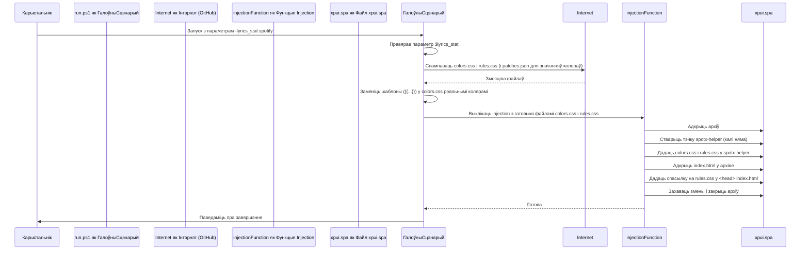

# Chapter 6: Устаўленыя дапаможныя сцэнарыі


Сардэчна запрашаем у шостую главу нашага падручніка па `Патчар SpotX для Spotify`! У [папярэднім раздзеле](05_сцэнарый_выдалення_.md) мы даведаліся, як SpotX дапамагае ачысціць Spotify ад сваіх змен з дапамогай сцэнарыя выдалення. Цяпер, калі мы разумеем, як SpotX вяртае файлы да зыходнага стану, прыйшоў час паглыбіцца ў тое, як ён дадае новую функцыянальнасць і візуальныя паляпшэнні, убудоўваючы свой уласны код непасрэдна ў Spotify. Гаворка пойдзе пра **Устаўленыя дапаможныя сцэнарыі**.

## Што такое Устаўленыя дапаможныя сцэнарыі і навошта яны патрэбны?

Успомнім, што Spotify, асабліва яго інтэрфейс, у значнай ступені пабудаваны на вэб-тэхналогіях (HTML, CSS, JavaScript), сабраных у файл `xpui.spa`. Думайце пра `xpui.spa` як пра спецыяльны "вэб-сайт", які запускаецца ўнутры прыкладання Spotify.

**Устаўленыя дапаможныя сцэнарыі** — гэта невялікія файлы з кодам (у асноўным на JavaScript `.js` або CSS `.css`), якія SpotX дадае ўнутр гэтага "вэб-сайта" Spotify, у `xpui.spa`. Гэты код выконваецца, калі вы запускаеце Spotify, і можа дынамічна змяняць тое, як выглядае ці працуе інтэрфейс.

**Галоўная задача ўстаўленых дапаможных сцэнарыяў** — дадаць новыя магчымасці або змяніць знешні выгляд Spotify, уводзячы ў яго ўласны код без змены арыгінальных файлаў Spotify. Замест таго, каб мяняць існуючы код Spotify (як у [Логіцы патчавання](04_логіка_патчавання_файлаў_spotify_.md)), SpotX можа проста дадаць свой уласны скрыпт або стыль, які будзе працаваць паралельна або мадыфікаваць існуючыя элементы.

Гэты механізм дазваляе SpotX рэалізоўваць такія функцыі, як:

*   Блакіроўка пэўных раздзелаў на галоўнай старонцы (напрыклад, падкастаў).
*   Змена візуальнага выгляду тэксту песень (нарыкла, колеру).
*   Даданне іншай дробнай функцыянальнасці, якая патрабуе выканання JavaScript у інтэрфейсе Spotify.

## Наш прыклад: Каляровы тэкст песень

Давайце возьмем канкрэтны прыклад, каб зразумець, як гэта працуе: **змена колеру тэксту песень** у Spotify. Звычайна тэкст песень мае стандартны колер. SpotX можа змяніць гэта, уставіўшы свой уласны CSS-стыль.

Як мы можам уключыць гэтую функцыю? З дапамогай параметраў, пра якія мы гаварылі ў [трэцяй главе](03_апрацоўка_параметраў_.md)! SpotX мае параметр `-lyrics_stat`, які дазваляе выбраць гатовы набор колераў для тэксту песень.

Напрыклад, каб ужыць набор колераў "spotify", вы запусціце SpotX з такім параметрам:

```powershell
.\run.ps1 -lyrics_stat spotify
```

Калі вы запусціце сцэнарый з гэтым параметрам, SpotX не проста ўсталюе Spotify (пры неабходнасці), але і ўставіць дадатковыя CSS-файлы ў `xpui.spa`, каб змяніць колеры тэксту песень на выбраныя.

## Як выглядаюць Устаўленыя дапаможныя сцэнарыі/стылі?

Гэтыя сцэнарыі і стылі — гэта звычайныя тэкставыя файлы з кодам JavaScript або CSS. SpotX захоўвае іх на GitHub і спампоўвае падчас устаноўкі.

Паглядзім на фрагменты CSS-файлаў, якія SpotX выкарыстоўвае для змены колеру тэксту песень (іх SpotX спампоўвае з адрасоў, падобных на `/css-helper/lyrics-color/colors.css` і `/css-helper/lyrics-color/rules.css`):

Файл `colors.css` (спрошчана):

```css
:root {
    --past: {{past}}; /* Колер мінулага радка */
    --current: {{current}}; /* Колер бягучага радка */
    --next: {{next}}; /* Колер будучага радка */
    --hover: {{hover}}; /* Колер пры навядзенні курсора */
    --background: {{background}}; /* Колер фону */
    --musixmatch: {{musixmatch}}; /* Колер тэксту Musixmatch */
}
```

*Тут мы бачым **шаблоны** (`{{...}}`), якія SpotX заменіць рэальнымі значэннямі колераў перад устаўкай файла.*

Файл `rules.css` (спрошчана):

```css
@import url('colors.css'); /* Імпартуем колеры з colors.css */

/* правілы для міні-тэксту песень */
.I2WIloMMjsBeMaIS8H3v,
.McI3hD7aCfpq015LJa6X,
.gpDSOimnzH4zTJmE7UR5 {
    --lyrics-color-active: var(--current) !important; /* Выкарыстоўваем пераменную --current */
    --lyrics-color-inactive: var(--next) !important; /* Выкарыстоўваем пераменную --next */
    --lyrics-color-passed: var(--past) !important;   /* Выкарыстоўваем пераменную --past */
    /* ... іншыя правілы ... */
}

/* правілы для поўнаэкраннага тэксту песень */
.FUYNhisXTCmbzt9IDxnT,
.tr8V5eHsUaIkOYVw7eSG,
.hW9km7ku6_iggdWDR_Lg {
    --lyrics-color-active: var(--current) !important; /* Выкарыстоўваем пераменную --current */
    --lyrics-color-inactive: var(--next) !important; /* Выкарыстоўваем пераменную --next */
    --lyrics-color-passed: var(--past) !important;   /* Выкарыстоўваем пераменную --past */
    --lyrics-color-background: var(--background) !important; /* Выкарыстоўваем пераменную --background */
}

/* ... іншыя правілы для розных элементаў тэксту песень ... */
```

*Гэты файл змяшчае CSS-правілы, якія выбіраюць пэўныя элементы ў інтэрфейсе Spotify (па класах, напрыклад, `.I2WIloMMjsBeMaIS8H3v`) і прымяняюць да іх колеры, вызначаныя ў `colors.css` праз пераменныя (`var(...)`).*

SpotX спампоўвае гэтыя два файлы, запаўняе шаблоны ў `colors.css` фактычнымі значэннямі колераў (узятымі з `patches.json` на аснове абранага `-lyrics_stat` значэння), і затым устаўляе абодва файлы ў `xpui.spa`.

## Як SpotX устаўляе дапаможныя сцэнарыі/стылі?

Працэс устаўкі кіруецца [Галоўным сцэнарыем устаноўкі](02_галоўны_сцэнарый_устаноўкі_.md) (`run.ps1`). Калі Галоўны сцэнарый апрацоўвае параметры і бачыць, што трэба ўключыць функцыю, якая патрабуе ўстаўкі файла, ён выклікае спецыяльную функцыю, якая займаецца гэтай задачай — функцыю `injection`.

Вось як гэта працуе (спрошчана):



Гэтая схема паказвае, што Галоўны сцэнарый вырашае, што трэба ўставіць, спампоўвае неабходныя файлы і перадае іх функцыі `injection`, якая выконвае ўсю тэхнічную працу па ўнясенні змен непасрэдна ў файл `xpui.spa`.

## Зазірнем у код: Функцыя `injection`

Функцыя `injection` знаходзіцца ў файле `run.ps1` і спецыяльна прызначана для ўстаўкі файлаў у ZIP-архіў `xpui.spa` і іх падключэння ў `index.html`.

Вось спрошчаны выгляд, як Галоўны сцэнарый выклікае `injection` для ўстаўкі файлаў стыляў тэксту песень:

```powershell
# ... код, які праверыў параметр $lyrics_stat ...
# ... код, які спампаваў colors.css і rules.css і замяніў шаблоны ў colors.css ($colorsContent) ...

# Калі параметр $lyrics_stat быў указаны, устаўляем файлы стыляў
if ($lyrics_stat) {
    # Выклікаем injection для дадання файлаў у xpui.spa
    injection -p $xpui_spa_patch `
              -f "spotx-helper/lyrics-color" ` # Папка ўнутры архіва
              -n @("rules.css", "colors.css") ` # Імёны файлаў для дадання
              -c @($rulesContent, $colorsContent) ` # Змесціва файлаў
              -i "rules.css" # Які файл падключыць у index.html
}
# ... іншы код ...
```

* Тут мы бачым выклік функцыі `injection`.
*   `-p $xpui_spa_patch`: Паказвае шлях да файла `xpui.spa`, які трэба мадыфікаваць.
*   `-f "spotx-helper/lyrics-color"`: Указвае тэчку ўнутры `xpui.spa`, куды трэба дадаць новыя файлы.
*   `-n @("rules.css", "colors.css")`: Спіс імёнаў файлаў, якія трэба дадаць.
*   `-c @($rulesContent, $colorsContent)`: Спіс змесціва для кожнага файла з `-n`. Змесціва `colors.css` ужо змяшчае рэальныя колеры замест шаблонаў.
*   `-i "rules.css"`: Указвае, што трэба дадаць `<link>` або `<script>` тэг у `index.html` толькі для файла `rules.css`. Паколькі `rules.css` імпартуе `colors.css`, дастаткова падключыць толькі `rules.css`.

Цяпер зазірнем у спрошчаны код самой функцыі `injection`:

```powershell
function injection {
    param(
        # ... параметры: шлях да архіва, тэчка, імёны, змесціва, файлы для падключэння ...
        [Alias("p")][string]$ArchivePath,
        [Alias("f")][string]$FolderInArchive,
        [Alias("n")][string[]]$FileNames,
        [Alias("c")][string[]]$FileContents,
        [Alias("i")][string[]]$FilesToInject
    )

    Add-Type -AssemblyName System.IO.Compression.FileSystem # Дадаем падтрымку ZIP
    # Адкрываем файл xpui.spa як ZIP-архіў для абнаўлення
    $archive = [System.IO.Compression.ZipFile]::Open($ArchivePath, 'Update')

    try {
        # Цыкл па файлах, якія трэба ўставіць (colors.css, rules.css)
        for ($i = 0; $i -lt $FileNames.Length; $i++) {
            $fileName = $FileNames[$i]
            $fileContent = $FileContents[$i]

            # Ствараем або адкрываем запіс (файл) у ZIP-архіве
            $entry = $archive.GetEntry("$FolderInArchive/$fileName")
            if ($entry -eq $null) {
                $stream = $archive.CreateEntry("$FolderInArchive/$fileName").Open()
            }
            else {
                $stream = $entry.Open()
            }

            # Запісваем змесціва ў гэты файл у архіве
            $writer = [System.IO.StreamWriter]::new($stream)
            $writer.Write($fileContent)

            $writer.Dispose()
            $stream.Dispose()
        }

        # Знаходзім index.html у архіве
        $indexEntry = $archive.Entries | Where-Object { $_.FullName -eq "index.html" }
        if ($indexEntry -ne $null) {
            # Чытаем змесціва index.html
            # ... код чытання ...
            $indexContent = "<html><head>...</head><body>...</body></html>" # Спрошчанае змесціва index.html

            # Знаходзім месца для ўстаўкі (<head> або <script>)
            $headTagIndex = $indexContent.IndexOf("</head>")
            $scriptTagIndex = $indexContent.IndexOf("<script")

            if ($headTagIndex -ge 0 -or $scriptTagIndex -ge 0) {
                # Вызначаем, якія файлы трэба падключыць (з параметрам -i або ўсе)
                $filesToInject = if ($FilesToInject) { $FilesToInject } else { $FileNames }

                # Для кожнага файла (у нашым выпадку rules.css)
                foreach ($fileName in $filesToInject) {
                    # Дадаем адпаведны тэг у index.html
                    if ($fileName.EndsWith(".css")) {
                        # Устаўляем <link> тэг перад </head>
                        $modifiedIndexContent = $indexContent.Insert($headTagIndex, "`<link href=`"/$FolderInArchive/$fileName`" rel=`"stylesheet`">`")
                        $indexContent = $modifiedIndexContent
                    }
                    # else if ($fileName.EndsWith(".js")) { ... дадаем <script> тэг ... }
                }

                # Выдаляем стары index.html і запісваем новы са спасылкамі на нашы стылі
                $indexEntry.Delete()
                $newIndexEntry = $archive.CreateEntry("index.html").Open()
                $indexWriter = [System.IO.StreamWriter]::new($newIndexEntry)
                $indexWriter.Write($indexContent)
                # ... закрываем патокі ...
            }
            # ... апрацоўка памылак ...
        }
        # ... апрацоўка памылак ...
    }
    finally {
        # Заўсёды закрываем ZIP-архіў
        if ($archive -ne $null) {
            $archive.Dispose()
        }
    }
}
```

*   Функцыя `injection` выкарыстоўвае класы .NET (`System.IO.Compression.ZipFile`) для працы з ZIP-архівам `xpui.spa`.
*   Яна праходзіць па спісе файлаў і іх змесціва, якія ёй перадалі (`$FileNames`, `$FileContents`).
*   Для кожнага файла яна стварае новы запіс (г.зн. дадае файл) у ZIP-архіве ў пазначанай тэчцы (`$FolderInArchive`).
*   Затым яна адкрывае файл `index.html` у гэтым жа архіве.
*   Яна шукае тэгі `<head>` або `<script>` у `index.html`.
*   На аснове імёнаў файлаў, якія трэба падключыць (`$FilesToInject`), яна ўстаўляе адпаведныя HTML-тэгі (`<link>` для CSS, `<script>` для JS) у `index.html`. Для CSS-файлаў тэг дадаецца ў секцыю `<head>`.
*   Нарэшце, яна замяняе арыгінальны `index.html` у архіве на змененае змесціва і закрывае архіў.

Такім чынам, калі Spotify запускаецца, ён загружае свой інтэрфейс з `xpui.spa`, у тым ліку `index.html`. Паколькі `index.html` цяпер мае спасылку на нашы новыя CSS-файлы (напрыклад, `rules.css` і `colors.css` у тэчцы `spotx-helper`), браўзер Spotify загружае гэтыя файлы, і правілы стыляў з іх прымяняюцца, змяняючы знешні выгляд тэксту песень.

Іншыя дапаможныя сцэнарыі, напрыклад, для блакіроўкі раздзелаў (`js-helper/sectionBlock.js`), устаўляюцца падобным чынам, але як `.js` файлы, і функцыя `injection` дадае іх як `<script>` тэгі ў `index.html`, каб яны выканаліся пры загрузцы інтэрфейсу Spotify.

## Высновы

Устаўленыя дапаможныя сцэнарыі і стылі — гэта магутны механізм, які дазваляе SpotX дадаваць новыя функцыі і візуальныя змены ў Spotify, убудоўваючы свой уласны код непасрэдна ў файлы інтэрфейсу Spotify (`xpui.spa`). Кіруючыся параметрамі, апрацаванымі [Галоўным сцэнарыем устаноўкі](02_галоўны_сцэнарый_устаноўкі_.md) і выкарыстоўваючы спецыялізаваную функцыю `injection`, SpotX спампоўвае гэтыя дапаможныя файлы, мадыфікуе іх пры неабходнасці (напрыклад, замяняючы шаблоны колераў) і дадае іх у ZIP-архіў `xpui.spa`, забяспечваючы іх загрузку і выкананне Spotify.

Разуменне гэтага механізма дапамагае ўбачыць, як SpotX пашырае магчымасці Spotify, выкарыстоўваючы яго ўнутраную структуру, пабудаваную на вэб-тэхналогіях.

Гэтая глава завяршае наша паглыбленае знаёмства з асноўнымі канцэпцыямі праекта `Патчар SpotX для Spotify`. Мы пачалі з таго, як ён "размаўляе" з намі ([Файлы моў](01_файлы_моў_.md)), разгледзелі яго "мозг" і "дырыжора" ([Галоўны сцэнарый устаноўкі](02_галоўны_сцэнарый_устаноўкі_.md)), даведаліся, як даваць яму інструкцыі ([Апрацоўка параметраў](03_апрацоўка_параметраў_.md)), зразумелі, як ён змяняе файлы ([Логіка патчавання файлаў Spotify](04_логіка_патчавання_файлаў_spotify_.md)), як адмяніць змены ([Сцэнарый выдалення](05_сцэнарый_выдалення_.md)) і, нарэшце, як ён дадае новыя функцыі, убудоўваючы код ([Устаўленыя дапаможныя сцэнарыі](06_устаўленыя_дапаможныя_сцэнарыі_.md)). Спадзяемся, гэты падручнік даў вам трывалае разуменне ўнутранай працы SpotX!

---

Generated by [AI Codebase Knowledge Builder](https://github.com/The-Pocket/Tutorial-Codebase-Knowledge)