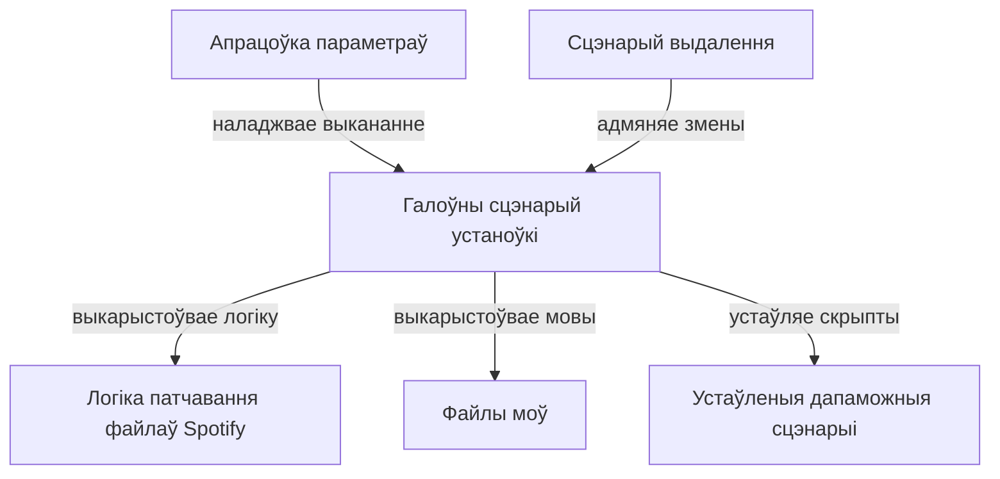

# Tutorial: Патчар SpotX для Spotify

Гэты праект - SpotX, патчар для Spotify на Windows. Ён дазваляе **наладзіць** ваш кліент Spotify, *выдаляючы рэкламу*, *дадаючы новыя функцыі* і *змяняючы яго знешні выгляд*. Устаноўка кіруецца галоўным сцэнарыем, які выкарыстоўвае файлы моў для зносін і ўлічвае вашы выбары праз параметры. Ёсць таксама сцэнарый для адмены ўнесеных змен.

**Source Repository:** [https://github.com/SpotX-Official/SpotX](https://github.com/SpotX-Official/SpotX)

## Chapters

1. [Файлы моў
](01_файлы_моў_.md)
2. [Галоўны сцэнарый устаноўкі
](02_галоўны_сцэнарый_устаноўкі_.md)
3. [Апрацоўка параметраў
](03_апрацоўка_параметраў_.md)
4. [Логіка патчавання файлаў Spotify
](04_логіка_патчавання_файлаў_spotify_.md)
5. [Сцэнарый выдалення
](05_сцэнарый_выдалення_.md)
6. [Устаўленыя дапаможныя сцэнарыі
](06_устаўленыя_дапаможныя_сцэнарыі_.md)

---

Generated by [AI Codebase Knowledge Builder](https://github.com/The-Pocket/Tutorial-Codebase-Knowledge)